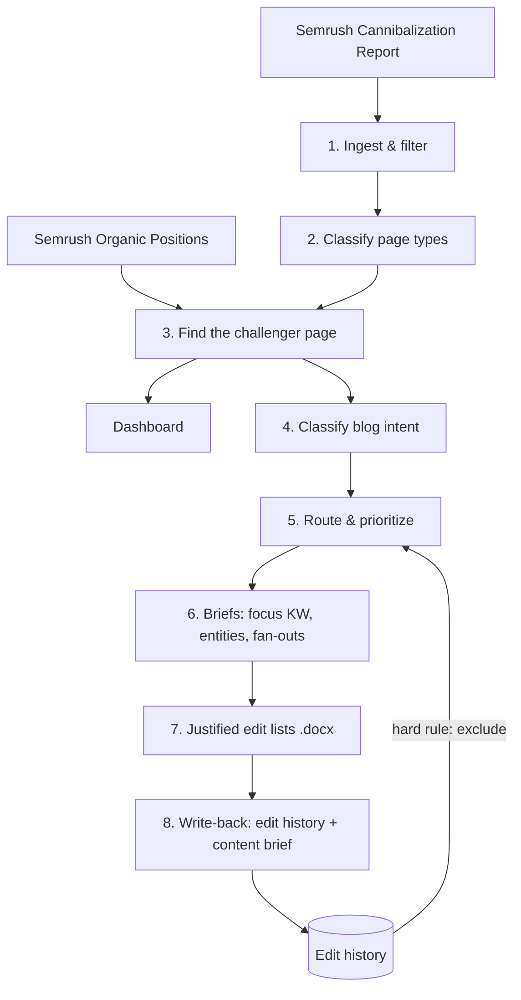

# Cannibalization Engine

**An SEO pipeline that finds where a site's own pages compete for the same keywords, decides which page to fix, and produces justified, client-ready edit lists.**

Built with Claude Code for a consumer-appliance brand. The client's identity has been anonymized ("Ecommerce" on `ecomusa.example`), and **all data in this repository is synthetic**.

**[▶ View the live demo dashboard](https://adamjaimesrey.github.io/seo-cannibalization-engine/)** (synthetic data, opens in your browser)

---

## The problem

When two pages on the same site rank for the same query, Google splits its signals between them. Rankings flip-flop, neither page wins decisively, and traffic leaks away. This is keyword cannibalization, and on content-heavy e-commerce sites it is usually a blog post competing with a product listing page (PLP) or product page (PDP).

SEO tools can *flag* cannibalization. What they don't do is answer the questions a client actually needs answered:

- **Which** of the competing pages is the problem?
- **What exactly** should change on it, and **why**?
- **Has this page already been fixed** in a previous round?

This pipeline answers all three, and turns the answers into a dashboard and a set of edit documents a content team can act on directly.

---

## How it works



| Stage | Script | What it does |
|---|---|---|
| 1. Ingest | `ingest.py` | Loads the Semrush Cannibalization export, maps columns **by header name** (exports are not stable), drops noise below position 30, flags priority keywords and routes each to a content or structural fix. |
| 2. Classify | `classify.py` | Labels every competing URL as blog, PLP or PDP from a curated lookup table. Unmatched URLs are flagged as `unknown`, never guessed. |
| 3. Enrich | `enrich.py` | The cannibalization report only names the *winning* page. This joins Semrush's Organic Positions data to identify the *challenger*: organic results only, deduplicated, ranked by a tiered rule (actionability first, then position, then traffic). |
| Dashboard | `dashboard.py` | A single self-contained HTML report (works offline, can be emailed): KPIs, charts, collapsible priority-action cards and the full audit table. |
| 4. Intent | `classify_intent.py` | Is each blog's focus keyword informational or commercial? Uses Semrush's intent data where available and inline LLM judgement elsewhere; disagreements are surfaced, not hidden. |
| 5. Route | `route_worklist.py`, `dedupe_worklist.py` | Selects blog-vs-commercial pairs, **excludes any page already in the edit history**, ranks by traffic at risk and routes each blog to *strengthen* (keep its keyword) or *refocus* (move it to an informational keyword). |
| 6–7. Edit lists | `build_edit_docs.py` | Renders each blog's edits as a `.docx` in the format *Where / Current / Replace with / Why*, and verifies that every "Current" quote actually exists on the page. |
| 8. Write-back | `build_history_rows.py`, `update_edit_histories.py`, `build_content_brief_rows.py` | Records every proposed edit in the edit history (never overwriting a real record) and generates paste-ready rows for the client's content brief. |

---

## Design decisions worth noticing

**Blogs are edited; commercial pages are protected.** In any blog-vs-product conflict, the blog is always the page that changes, whichever one is currently winning. Product and listing pages only ever get meta title/description suggestions. Edits are capped at 10 per page, so fixes stay surgical.

**Hard rules are enforced in code, not just written down.** "Never re-propose a page that has already been edited" lives in `CLAUDE.md`, *and* is enforced in `route_worklist.py`, which refuses to run if the edit history can't be read. A rule that depends on someone remembering it isn't a rule.

**Every claim is verified from disk.** Row counts are re-read from the written files (CSV-aware, since exports contain embedded newlines), edit-list quotes are checked against the source copy, and generated files are compared against hand-built references before a stage is trusted.

**Humans stay in the loop where judgement matters.** Choosing a replacement keyword, approving entities and pasting into client-owned documents are deliberate human-in-the-loop gates. The pipeline prepares the decision; a person makes it.

**Manual steps are designed to be swapped for APIs.** Where a step currently relies on a manual Semrush lookup, it takes the same inputs and produces the same outputs an API call would, so automating it later is a small change rather than a rewrite.

**Nothing sensitive can be published by accident.** `scripts/leak_check.py` scans the whole repository against a local, never-committed deny list of client terms and fails loudly if it finds any. It runs before every push.

---

## Where the Semrush data comes in

The pipeline uses two Semrush exports:

| Export | Semrush location | Columns the pipeline reads |
|---|---|---|
| **Cannibalization Report** | Special Reports | Keyword, Best URL (End), Position (End), All/Best Ranking URLs (Count), Best ranked URL changes, Traffic Risk, Search Volume, plus volatility and position-delta columns |
| **Organic Positions** | Organic Research → Positions | Keyword, URL, Position, Traffic, Keyword Intents, Position Type |

Two details that matter when working with the Positions export:

- **Position Type must be filtered to `Organic`.** The export also lists AI Overview, People Also Ask and other SERP-feature placements; counted as competing pages, they would invent cannibalization that doesn't exist.
- **The same URL often appears several times for one keyword.** Rows are deduplicated per keyword and URL, keeping the best position.

Keyword research during remediation (volume and intent checks, related topics) currently uses Semrush's Keyword Overview and Keyword Magic Tool by hand. These are the steps designed to move to the Semrush API.

`sample_data/` contains synthetic versions of both exports with Semrush's exact column names and order, so the data shapes can be inspected without any real data.

---

## Run the demo

Requires Python 3.

```bash
python3 -m venv .venv
source .venv/bin/activate
pip install -r requirements.txt
bash scripts/run_demo.sh
```

The demo stages the synthetic data, runs every stage in order and prints what each one found. Then open `output/dashboard.html` in a browser, and see `output/edit-lists/` for a sample edit list.

Stage 6 (writing the briefs and edits) relies on LLM judgement and human review, so the demo ships one finished example rather than generating it.

---

## Built with Claude Code

This project was built with Claude Code, and the files that directed it are part of the repository:

- **`CLAUDE.md`**: project context, working rules and hard rules that every session reads first.
- **`SPEC.md`**: the design contract, written before the code.
- **`.claude/settings.json`**: permissions. Routine commands are pre-approved; deleting files, installing packages and reading secrets are denied.

The working method: plan mode before any build, one step at a time, manual review of every diff, verification against real data before trusting a stage, and a commit after every passing check.

---

## Repository structure

```
scripts/        the pipeline, one script per stage, plus run_demo.sh and leak_check.py
sample_data/    synthetic inputs for the demo
data/           raw and processed data (generated at run time, not committed)
output/         dashboard and edit lists (generated at run time, not committed)
CLAUDE.md       instructions for Claude Code
SPEC.md         design specification
```

---

## About

Built by Adam Jaimes Rey, SEO and GEO consultant.

---

## Licence

All rights reserved. This repository is shared for review and portfolio purposes only.
